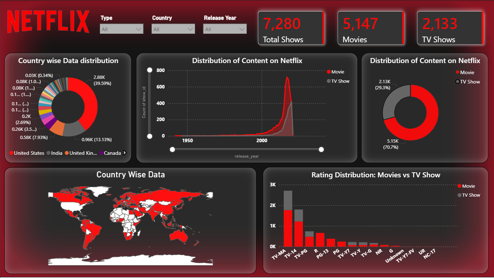

# Netflix Exploratory Data Analysis (EDA)

## Problem Statement
The Netflix dataset contains information about movies and TV shows
available on the platform. The goal is to explore and analyze the dataset
to identify trends, patterns and insights about content type, country,
ratings, genres and release years.

## Dataset
- **Source:** [Kaggle Netflix Dataset](https://www.kaggle.com/datasets/shivamb/netflix-shows)
- **Rows:** 8807
- **Columns:** 12

## Approach

### 1. Data Cleaning
- Dropped `director` column due to excessive missing values
- Filled missing values in `cast`, `country`, `rating` and `date_added` with `'Unknown'`
- Removed duplicates

### 2. Exploratory Data Analysis
- Content type distribution (Movies vs TV Shows)
- Content added over the years
- Top content producing countries
- Most popular genres
- Rating distribution
- Duration analysis
- Correlation analysis between numerical columns
- Outlier detection in release year

## Key Insights
- **Movies dominate** Netflix over TV Shows
- **United States** is the largest content contributor followed by India
- Netflix content additions **peaked around 2018** and gradually declined
- **TV-MA** is the most dominant rating confirming adult-first content strategy
- **South Korea and Japan** are exceptions producing more TV Shows than movies
- **International Movies, Dramas and Comedies** are the most popular genres
- Older content tends to have **longer duration** compared to recent releases

## Tools Used
- Python
- Pandas
- Matplotlib
- Seaborn
- Jupyter Notebook

## Dashboard

Built using **Power BI** on the cleaned Netflix dataset.

### Preview

### File
- `Dashboard.pbix` — Power BI dashboard file

> To view the dashboard, download the `.pbix` file and
> open it using [Power BI Desktop](https://powerbi.microsoft.com/desktop)
> which is available for free.